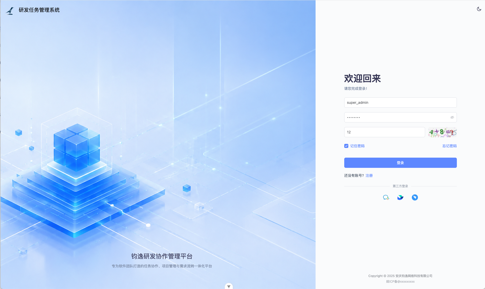
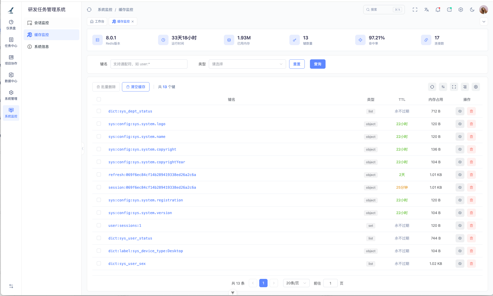
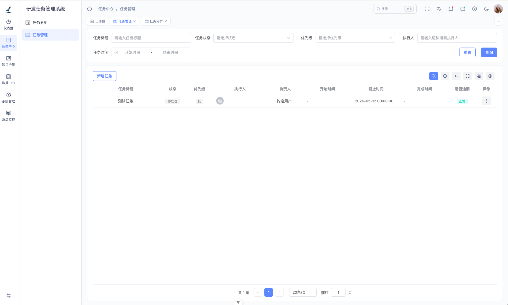

# 钧逸研发任务管理系统（开发中）

# 项目介绍

钧逸研发任务管理系统是专门为像**软件开发团队**、**产品研发团队**等打造的轻量级任务协作平台，可以内嵌于**企业微信**、**飞书**、**钉钉**等作为团队内部、企业内部使用的协同系统。
致力于提升团队在任务分配、进度跟踪、协作沟通方面的效率。

项目适用于中小型研发团队、外包团队以及技术创业团队。


API接口文档：https://lk458yviee.apifox.cn


# 项目功能展示
<div align="center">
<table>
<tr>
<td align="center">
    <br/>
    <b>登录界面</b>
</td>
<td align="center">
    <br/>
    <b>邀请码注册</b>
</td>
</tr>

<tr>
<td align="center">
     <br/>
    <b>任务管理</b>
</td>
<td align="center">
     <br/>
    <b>任务审核</b>
</td>
</tr>

</table>

</div>

# 项目启动

**环境说明**：

- Java21
- MySQL8.0
- Redis
- Node.js 20以上

### 1、后端启动

使用 `git` Clone本项目，使用IDEA或其他IDE打开本项目，创建一个MySQL数据库`task-flow`，将数据库SQL文件导入到该数据库中。

在后端 `junoyi-server` 模块是后端主入口核心模块，打开模块，在 `resource` 中存在两个核心配置文件：
- application.yml
- application-local.yml

打开 `application-local.yml` 配置文件将一下内容进行修改：

```yaml
  # ==================== 数据源配置 ====================
  datasource:
    # 动态数据源配置
    dynamic:
      primary: master
      strict: true
      # 数据源列表
      datasource:
        # 主库配置
        master:
          driver-class-name: com.mysql.cj.jdbc.Driver
          url: jdbc:mysql://localhost:3306/task-flow?useUnicode=true&characterEncoding=utf8&serverTimezone=Asia/Shanghai&useSSL=false&allowPublicKeyRetrieval=true&rewriteBatchedStatements=true
          username: root
          password: 123456

      # Druid 连接池配置
```
将数据库进行修改，修改对应的数据库、账号和密码。

```yaml
  # ==================== Redis 配置 ====================
  data:
    redis:
      host: 127.0.0.1
      port: 6379
      database: 1
      timeout: 10s
      # password: 123456

```

Redis缓存数据库默认使用 1 号数据库，默认不使用密码，该应用所有的缓存数据，每个key都会有隔离的，不会与其他应用产生冲突。

```yaml
# ==================== Redisson 配置 ====================
redisson:
  keyPrefix: junoyi
  threads: 4
```

默认隔离缓存使用 key 前缀为 `junoyi`，有需要自行修改。

打开 `application.yml` 配置文件看情况需要修改一下几个地方：

```yaml
log:
    # 文件输出配置
    file:
      # 是否启用文件日志输出
      enabled: true
      # 日志文件存储目录（只提供目录，不包含文件名）
      path: ./temp/logs
```

默认日志文件会存储在 ./temp/logs目录下，这个自动生成该目录，有需要自行修改。

```yaml
  # ==================== 安全验证配置 ====================
  security:
    # api 接口加密 (建议: 开发环境将接口加密关闭方便调试，生产环境开启保证安全)
    # 建议：
    # 生产环境不要使用示例中的密钥对，请自行生成密钥对替换resource/keys/目录中的密钥文件
    # 推荐生成1024位以上密钥，2048、4096位也可以，不建议提高安全性了但是会降低性能
    api-encrypt:
      enable: false
      # 是否加密请求体
      request: true
      # 是否加密响应体
      response: true
```

接口加密在开发环境中不建议打开，前端默认开发环境不进行接口加密，如果需要打包部署，请开启接口加密。

最后一点，如果需要使用到 `企业微信`、`飞书`、`钉钉`等，请自行按照 `application.yml` 配置中注释的意思去完成配置即可。

然后可以通过 IDEA 启动 SpringBoot，或者mvn run:spring

### 2、前端

前端部分统一放在 `junoyi-ui` 目录下，请cd进入到 junoyi-ui 目录后，然后请使用 `pnpm` 包管理器去 `pnpm install`，然后再 `pnpm dev`。

> 请注意：前端非常推荐只使用 pnpm ，不建议使用 npm。

启动完成后，自动会打开跳转到浏览器对应页面。（前提：优先启动后端，保证后端正确启动）

# 免费获取数据库SQL文件

打开微信关注官方公众号「钧逸网络科技」，回复 `研发任务管理系统数据库`，即可免费获取完整数据库结构和数据。

<div align="center">
    
</div>

后续更新计划将持续在公众号上发布更新。如果想要获取该项目完整商业授权，请通过微信公众号，联系我们的客服！


# 商业使用说明（开源协议）

本项目基于 AGPL-3.0 协议开源。

对于以下行为免费使用：
- 个人学习、研究用途
- 非商业项目
- 企业需要内部使用，需保持开源

以下情况属于商业使用，需要获得授权：
- 企业内部使用本系统（未开源）
- 用于商业项目或收费系统
- 提供 SaaS / 在线服务
- 对系统进行二次开发后闭源使用

> 如需商业授权，请联系：
> 
> 邮箱：support@junoyi.com
> 
> 手机：13160393978
> 
> 微信公众号：钧逸网络科技
